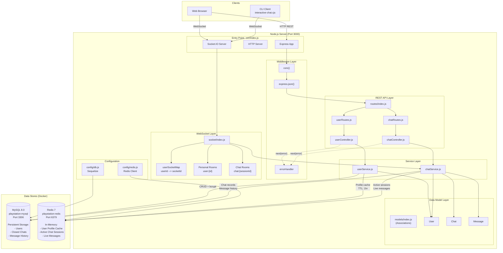
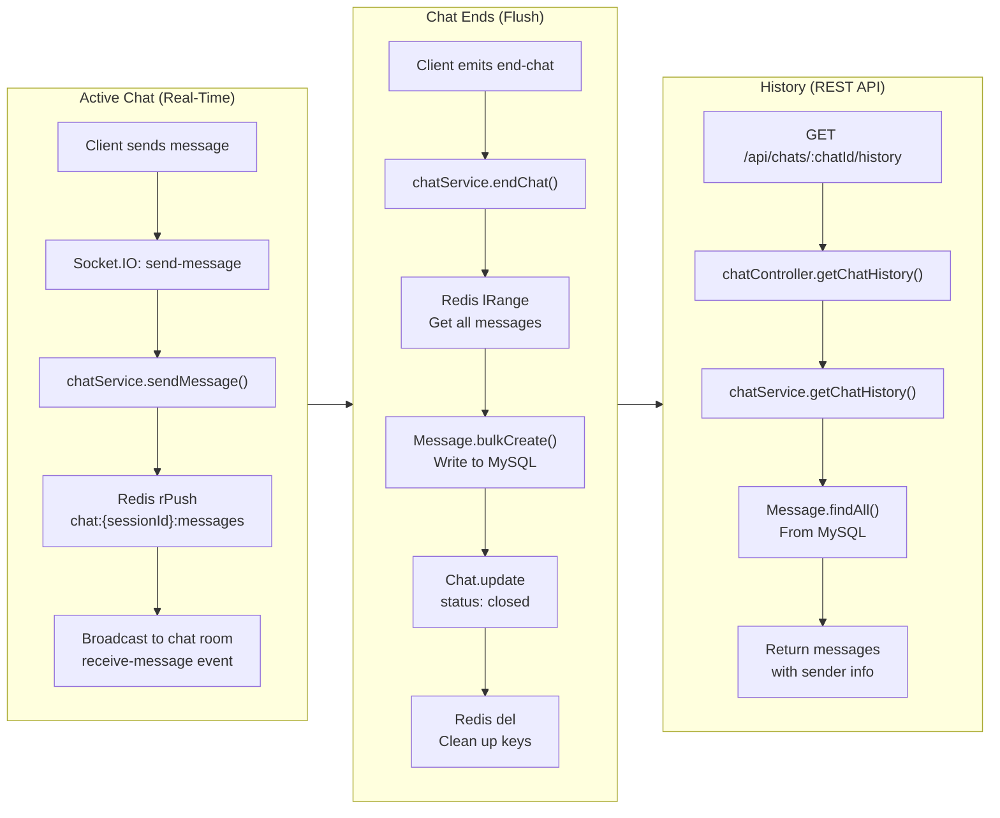
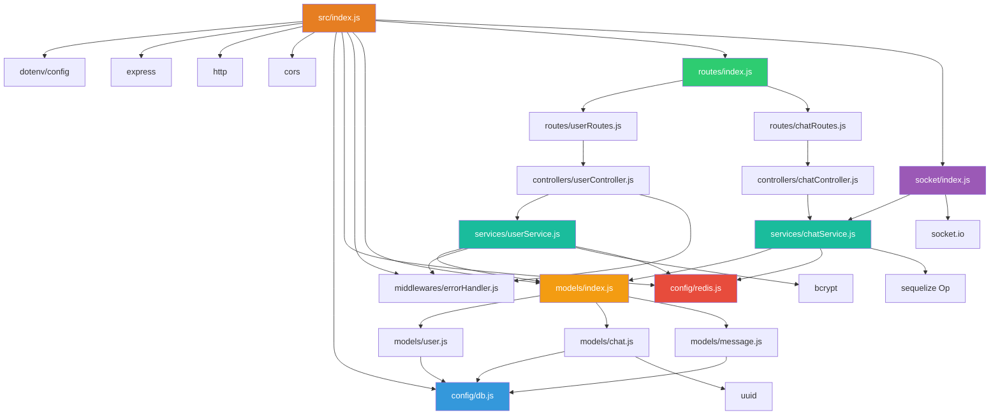

# PlayStation Chat App - Architecture Overview

## High-Level Architecture

## Data Flow: Dual-Storage Pattern

## Module Dependency Graph

## Folder Index

| Diagram | File | Description |
|---------|------|-------------|
| **This file** | `diagrams/architecture-overview.md` | High-level architecture, data flow, module dependencies |
| **Models** | `diagrams/models/entity-relationship.md` | ER diagram with all table schemas |
| **Models** | `diagrams/models/model-classes.md` | Class diagram of Sequelize models |
| **Controllers** | `diagrams/controllers/controllers.md` | Request handling flows for user & chat controllers |
| **Services** | `diagrams/services/services.md` | Business logic flowcharts for userService & chatService |
| **Routes** | `diagrams/routes/routes.md` | API endpoint tree and full endpoint reference |
| **Socket** | `diagrams/socket/socket-events.md` | All Socket.IO event sequence diagrams and room structure |
| **Config** | `diagrams/config/config.md` | Database & Redis configuration and connection lifecycle |
| **Middleware** | `diagrams/middleware/middleware.md` | Express middleware pipeline and error handling flow |
| **Infrastructure** | `diagrams/infrastructure/infrastructure.md` | Docker Compose, startup sequence, network topology |
