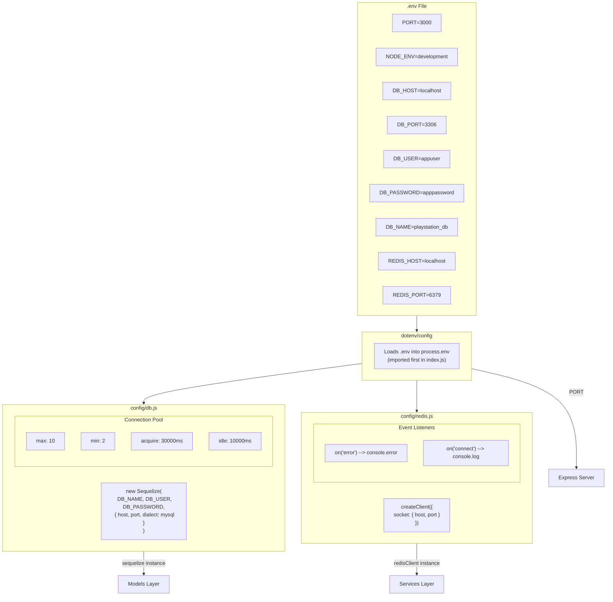
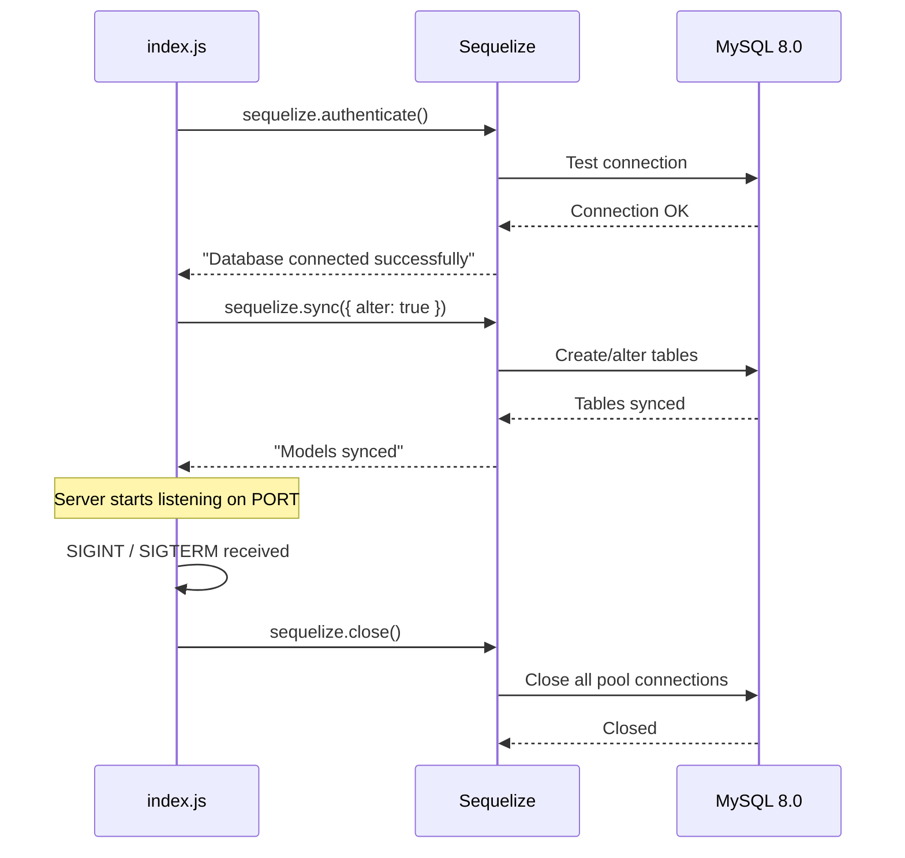
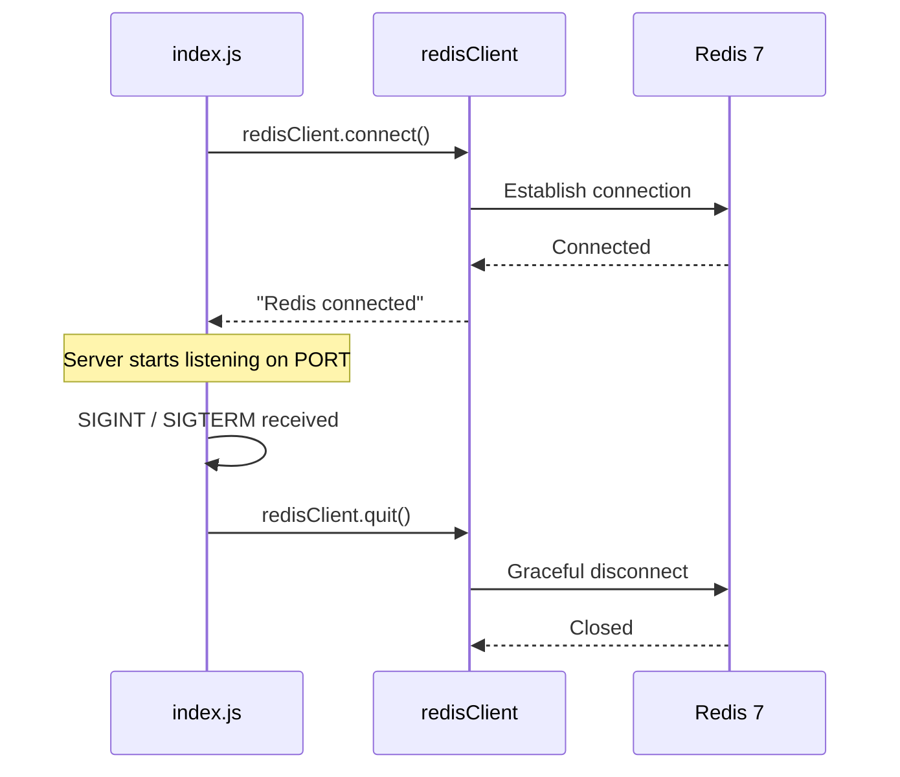

# Configuration - Database & Redis Setup

## Configuration Architecture

```mermaid
flowchart TD
    subgraph EnvFile[".env File"]
        PORT["PORT=3000"]
        NODE_ENV["NODE_ENV=development"]
        DB_HOST["DB_HOST=localhost"]
        DB_PORT["DB_PORT=3306"]
        DB_USER["DB_USER=appuser"]
        DB_PASSWORD["DB_PASSWORD=apppassword"]
        DB_NAME["DB_NAME=playstation_db"]
        REDIS_HOST["REDIS_HOST=localhost"]
        REDIS_PORT["REDIS_PORT=6379"]
    end

    subgraph DotEnv["dotenv/config"]
        Loader["Loads .env into process.env\n(imported first in index.js)"]
    end

    subgraph DBConfig["config/db.js"]
        Sequelize["new Sequelize(\n  DB_NAME, DB_USER, DB_PASSWORD,\n  { host, port, dialect: mysql }\n)"]

        subgraph Pool["Connection Pool"]
            Max["max: 10"]
            Min["min: 2"]
            Acquire["acquire: 30000ms"]
            Idle["idle: 10000ms"]
        end
    end

    subgraph RedisConfig["config/redis.js"]
        RedisClient["createClient({\n  socket: { host, port }\n})"]

        subgraph RedisEvents["Event Listeners"]
            OnError["on('error') --> console.error"]
            OnConnect["on('connect') --> console.log"]
        end
    end

    EnvFile --> DotEnv
    DotEnv --> DBConfig
    DotEnv --> RedisConfig
    DotEnv --> |PORT| Server["Express Server"]

    DBConfig --> |"sequelize instance"| Models["Models Layer"]
    RedisConfig --> |"redisClient instance"| Services["Services Layer"]
```

## Sequelize Connection Lifecycle

```mermaid
sequenceDiagram
    participant App as index.js
    participant Seq as Sequelize
    participant MySQL as MySQL 8.0

    App->>Seq: sequelize.authenticate()
    Seq->>MySQL: Test connection
    MySQL-->>Seq: Connection OK
    Seq-->>App: "Database connected successfully"

    App->>Seq: sequelize.sync({ alter: true })
    Seq->>MySQL: Create/alter tables
    MySQL-->>Seq: Tables synced
    Seq-->>App: "Models synced"

    Note over App: Server starts listening on PORT

    App->>App: SIGINT / SIGTERM received
    App->>Seq: sequelize.close()
    Seq->>MySQL: Close all pool connections
    MySQL-->>Seq: Closed
```

## Redis Connection Lifecycle

```mermaid
sequenceDiagram
    participant App as index.js
    participant RC as redisClient
    participant Redis as Redis 7

    App->>RC: redisClient.connect()
    RC->>Redis: Establish connection
    Redis-->>RC: Connected
    RC-->>App: "Redis connected"

    Note over App: Server starts listening on PORT

    App->>App: SIGINT / SIGTERM received
    App->>RC: redisClient.quit()
    RC->>Redis: Graceful disconnect
    Redis-->>RC: Closed
```
