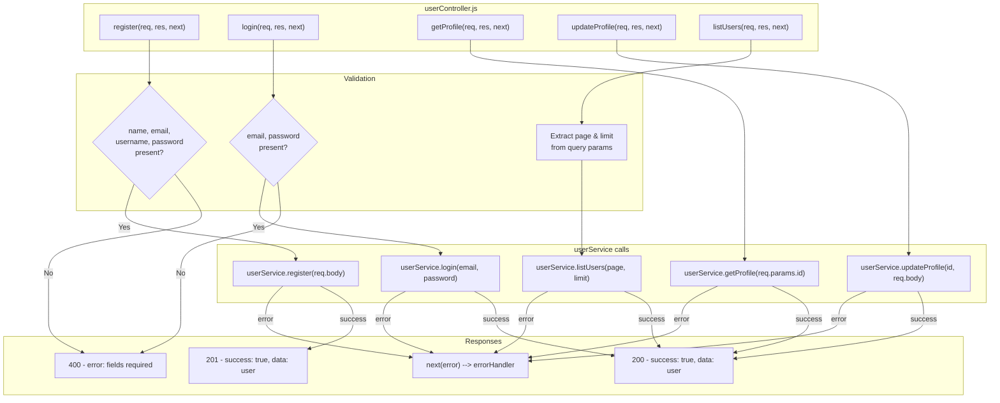
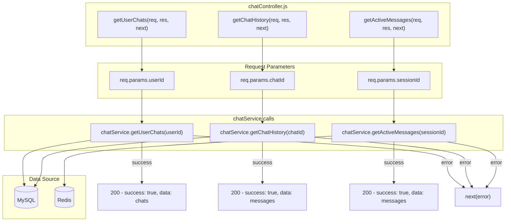

# Controllers - Request Handling Flow

## User Controller

```mermaid
flowchart TD
    subgraph UserController["userController.js"]
        REG["register(req, res, next)"]
        LOG["login(req, res, next)"]
        GP["getProfile(req, res, next)"]
        UP["updateProfile(req, res, next)"]
        LU["listUsers(req, res, next)"]
    end

    subgraph Validation
        V1{"name, email,\nusername, password\npresent?"}
        V2{"email, password\npresent?"}
        V3["Extract page & limit\nfrom query params"]
    end

    subgraph ServiceCalls["userService calls"]
        S1["userService.register(req.body)"]
        S2["userService.login(email, password)"]
        S3["userService.getProfile(req.params.id)"]
        S4["userService.updateProfile(id, req.body)"]
        S5["userService.listUsers(page, limit)"]
    end

    subgraph Responses
        R201["201 - success: true, data: user"]
        R200["200 - success: true, data: user"]
        R400["400 - error: fields required"]
        RERR["next(error) --> errorHandler"]
    end

    REG --> V1
    V1 -- No --> R400
    V1 -- Yes --> S1
    S1 -- success --> R201
    S1 -- error --> RERR

    LOG --> V2
    V2 -- No --> R400
    V2 -- Yes --> S2
    S2 -- success --> R200
    S2 -- error --> RERR

    GP --> S3
    S3 -- success --> R200
    S3 -- error --> RERR

    UP --> S4
    S4 -- success --> R200
    S4 -- error --> RERR

    LU --> V3 --> S5
    S5 -- success --> R200
    S5 -- error --> RERR
```

## Chat Controller

```mermaid
flowchart TD
    subgraph ChatController["chatController.js"]
        GUC["getUserChats(req, res, next)"]
        GCH["getChatHistory(req, res, next)"]
        GAM["getActiveMessages(req, res, next)"]
    end

    subgraph Params["Request Parameters"]
        P1["req.params.userId"]
        P2["req.params.chatId"]
        P3["req.params.sessionId"]
    end

    subgraph ServiceCalls["chatService calls"]
        CS1["chatService.getUserChats(userId)"]
        CS2["chatService.getChatHistory(chatId)"]
        CS3["chatService.getActiveMessages(sessionId)"]
    end

    subgraph DataSource["Data Source"]
        MySQL[(MySQL)]
        Redis[(Redis)]
    end

    GUC --> P1 --> CS1 --> MySQL
    GCH --> P2 --> CS2 --> MySQL
    GAM --> P3 --> CS3 --> Redis

    CS1 -- "success" --> R1["200 - success: true, data: chats"]
    CS2 -- "success" --> R2["200 - success: true, data: messages"]
    CS3 -- "success" --> R3["200 - success: true, data: messages"]

    CS1 -- "error" --> ERR["next(error)"]
    CS2 -- "error" --> ERR
    CS3 -- "error" --> ERR
```
