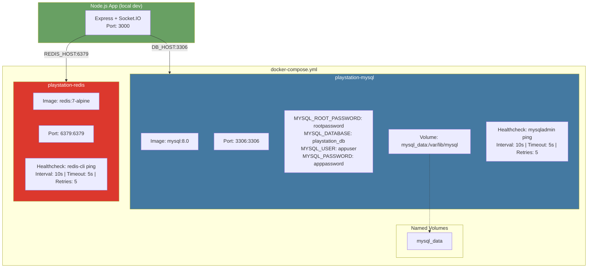
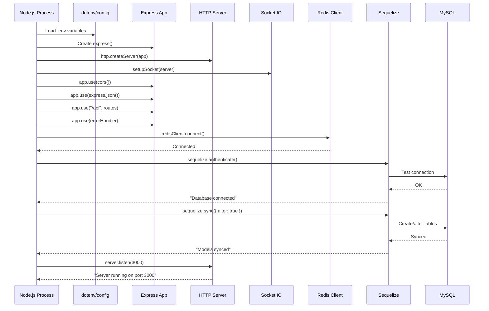
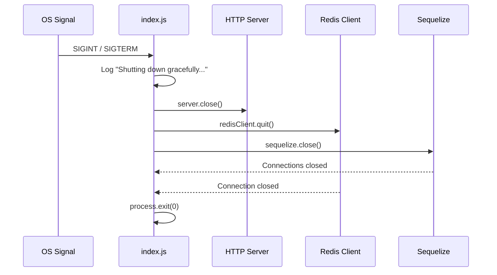
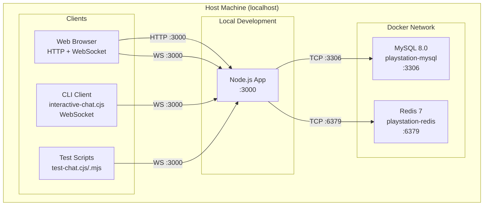

# Infrastructure - Docker & Deployment

## Docker Compose Architecture

```mermaid
flowchart TD
    subgraph DockerCompose["docker-compose.yml"]

        subgraph MySQLContainer["playstation-mysql"]
            MySQLImg["Image: mysql:8.0"]
            MySQLPort["Port: 3306:3306"]
            MySQLEnv["MYSQL_ROOT_PASSWORD: rootpassword\nMYSQL_DATABASE: playstation_db\nMYSQL_USER: appuser\nMYSQL_PASSWORD: apppassword"]
            MySQLVol["Volume: mysql_data:/var/lib/mysql"]
            MySQLHealth["Healthcheck: mysqladmin ping\nInterval: 10s | Timeout: 5s | Retries: 5"]
        end

        subgraph RedisContainer["playstation-redis"]
            RedisImg["Image: redis:7-alpine"]
            RedisPort["Port: 6379:6379"]
            RedisHealth["Healthcheck: redis-cli ping\nInterval: 10s | Timeout: 5s | Retries: 5"]
        end

        subgraph Volumes["Named Volumes"]
            Vol1["mysql_data"]
        end
    end

    subgraph NodeApp["Node.js App (local dev)"]
        App["Express + Socket.IO\nPort: 3000"]
    end

    App -- "DB_HOST:3306" --> MySQLContainer
    App -- "REDIS_HOST:6379" --> RedisContainer
    MySQLVol -.-> Vol1

    style MySQLContainer fill:#4479a1,color:#fff
    style RedisContainer fill:#dc382d,color:#fff
    style NodeApp fill:#68a063,color:#fff
```

## Application Startup Sequence

```mermaid
sequenceDiagram
    participant Process as Node.js Process
    participant Dotenv as dotenv/config
    participant Express as Express App
    participant HTTP as HTTP Server
    participant SIO as Socket.IO
    participant Redis as Redis Client
    participant Seq as Sequelize
    participant MySQL as MySQL

    Process->>Dotenv: Load .env variables
    Process->>Express: Create express()
    Process->>HTTP: http.createServer(app)
    Process->>SIO: setupSocket(server)

    Process->>Express: app.use(cors())
    Process->>Express: app.use(express.json())
    Process->>Express: app.use("/api", routes)
    Process->>Express: app.use(errorHandler)

    Process->>Redis: redisClient.connect()
    Redis-->>Process: Connected

    Process->>Seq: sequelize.authenticate()
    Seq->>MySQL: Test connection
    MySQL-->>Seq: OK
    Seq-->>Process: "Database connected"

    Process->>Seq: sequelize.sync({ alter: true })
    Seq->>MySQL: Create/alter tables
    MySQL-->>Seq: Synced
    Seq-->>Process: "Models synced"

    Process->>HTTP: server.listen(3000)
    HTTP-->>Process: "Server running on port 3000"
```

## Graceful Shutdown

```mermaid
sequenceDiagram
    participant OS as OS Signal
    participant App as index.js
    participant HTTP as HTTP Server
    participant Redis as Redis Client
    participant Seq as Sequelize

    OS->>App: SIGINT / SIGTERM
    App->>App: Log "Shutting down gracefully..."
    App->>HTTP: server.close()
    App->>Redis: redisClient.quit()
    App->>Seq: sequelize.close()
    Seq-->>App: Connections closed
    Redis-->>App: Connection closed
    App->>App: process.exit(0)
```

## Network Topology

```mermaid
graph TB
    subgraph Host["Host Machine (localhost)"]
        subgraph DockerNetwork["Docker Network"]
            MySQL["MySQL 8.0\nplaystation-mysql\n:3306"]
            Redis["Redis 7\nplaystation-redis\n:6379"]
        end

        subgraph LocalDev["Local Development"]
            Node["Node.js App\n:3000"]
        end

        subgraph ClientLayer["Clients"]
            Browser["Web Browser\nHTTP + WebSocket"]
            CLI["CLI Client\ninteractive-chat.cjs\nWebSocket"]
            Test["Test Scripts\ntest-chat.cjs/.mjs"]
        end
    end

    Browser -- "HTTP :3000" --> Node
    Browser -- "WS :3000" --> Node
    CLI -- "WS :3000" --> Node
    Test -- "WS :3000" --> Node
    Node -- "TCP :3306" --> MySQL
    Node -- "TCP :6379" --> Redis
```
