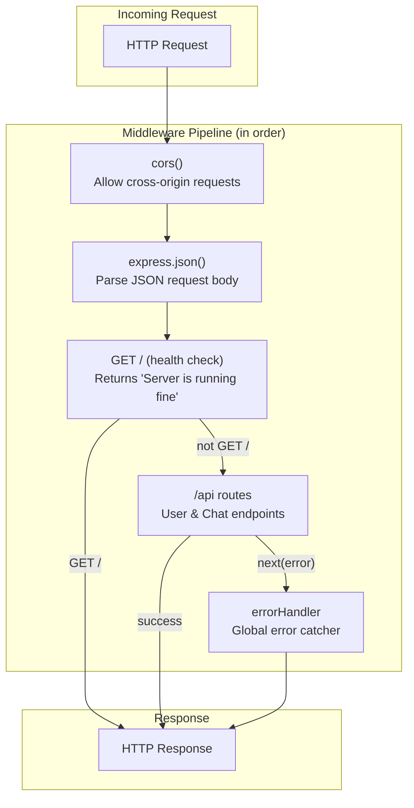
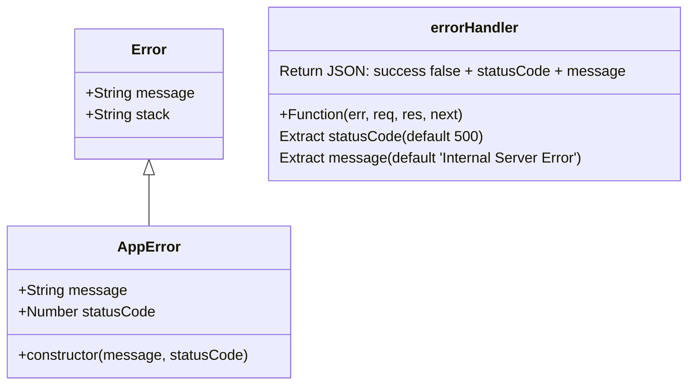
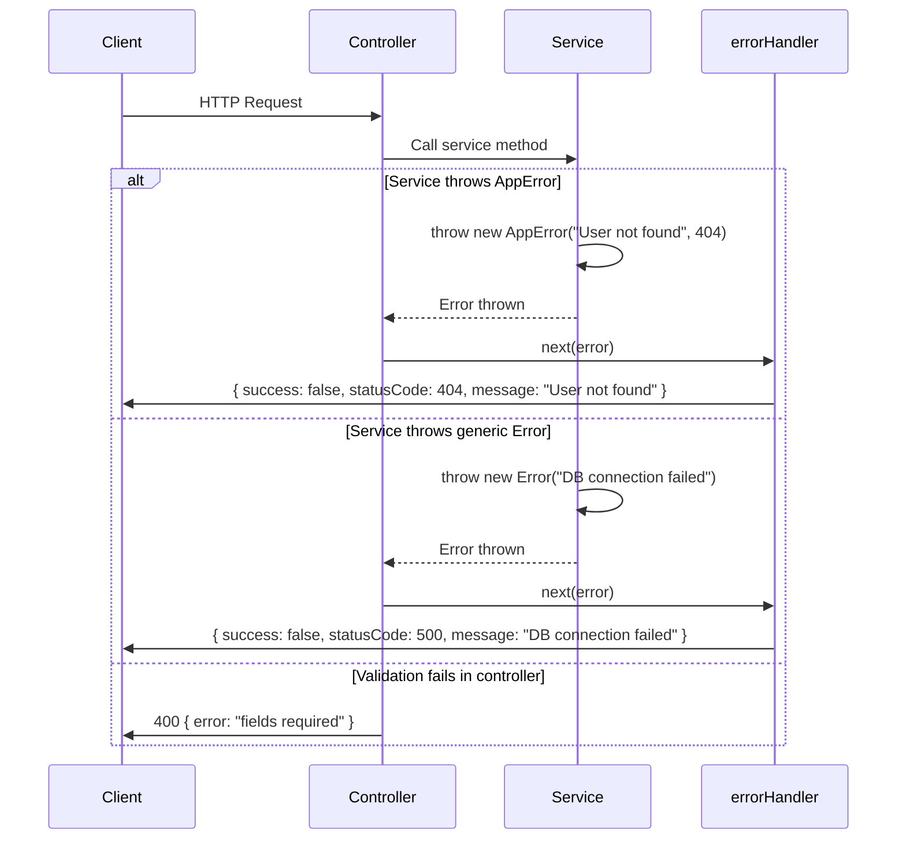

# Middleware - Error Handling & Request Pipeline

## Express Middleware Stack

```mermaid
flowchart TD
    subgraph Request["Incoming Request"]
        REQ["HTTP Request"]
    end

    subgraph MiddlewareStack["Middleware Pipeline (in order)"]
        CORS["cors()\nAllow cross-origin requests"]
        JSON["express.json()\nParse JSON request body"]
        HEALTH["GET / (health check)\nReturns 'Server is running fine'"]
        ROUTES["/api routes\nUser & Chat endpoints"]
        ERR["errorHandler\nGlobal error catcher"]
    end

    subgraph Response["Response"]
        RES["HTTP Response"]
    end

    REQ --> CORS --> JSON --> HEALTH
    HEALTH -- "not GET /" --> ROUTES
    HEALTH -- "GET /" --> RES
    ROUTES -- "success" --> RES
    ROUTES -- "next(error)" --> ERR --> RES
```

## Error Handler Detail

```mermaid
classDiagram
    class AppError {
        +String message
        +Number statusCode
        +constructor(message, statusCode)
    }

    class Error {
        +String message
        +String stack
    }

    Error <|-- AppError

    class errorHandler {
        +Function(err, req, res, next)
        Extract statusCode (default 500)
        Extract message (default 'Internal Server Error')
        Return JSON: success false + statusCode + message
    }
```

## Error Flow

```mermaid
sequenceDiagram
    participant C as Client
    participant Ctrl as Controller
    participant Svc as Service
    participant EH as errorHandler

    C->>Ctrl: HTTP Request
    Ctrl->>Svc: Call service method

    alt Service throws AppError
        Svc->>Svc: throw new AppError("User not found", 404)
        Svc-->>Ctrl: Error thrown
        Ctrl->>EH: next(error)
        EH->>C: { success: false, statusCode: 404, message: "User not found" }
    else Service throws generic Error
        Svc->>Svc: throw new Error("DB connection failed")
        Svc-->>Ctrl: Error thrown
        Ctrl->>EH: next(error)
        EH->>C: { success: false, statusCode: 500, message: "DB connection failed" }
    else Validation fails in controller
        Ctrl->>C: 400 { error: "fields required" }
    end
```
