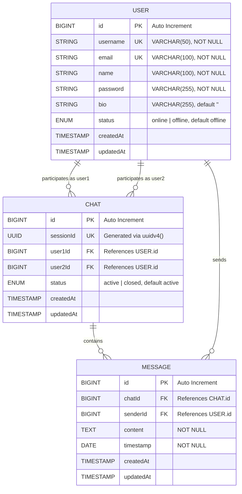
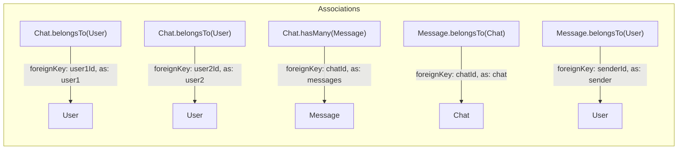

# Models - Entity Relationship Diagram

```mermaid
erDiagram
    USER {
        BIGINT id PK "Auto Increment"
        STRING username UK "VARCHAR(50), NOT NULL"
        STRING email UK "VARCHAR(100), NOT NULL"
        STRING name "VARCHAR(100), NOT NULL"
        STRING password "VARCHAR(255), NOT NULL"
        STRING bio "VARCHAR(255), default ''"
        ENUM status "online | offline, default offline"
        TIMESTAMP createdAt
        TIMESTAMP updatedAt
    }

    CHAT {
        BIGINT id PK "Auto Increment"
        UUID sessionId UK "Generated via uuidv4()"
        BIGINT user1Id FK "References USER.id"
        BIGINT user2Id FK "References USER.id"
        ENUM status "active | closed, default active"
        TIMESTAMP createdAt
        TIMESTAMP updatedAt
    }

    MESSAGE {
        BIGINT id PK "Auto Increment"
        BIGINT chatId FK "References CHAT.id"
        BIGINT senderId FK "References USER.id"
        TEXT content "NOT NULL"
        DATE timestamp "NOT NULL"
        TIMESTAMP createdAt
        TIMESTAMP updatedAt
    }

    USER ||--o{ CHAT : "participates as user1"
    USER ||--o{ CHAT : "participates as user2"
    CHAT ||--o{ MESSAGE : "contains"
    USER ||--o{ MESSAGE : "sends"
```

## Associations (defined in `models/index.js`)

```mermaid
graph LR
    subgraph Associations
        A["Chat.belongsTo(User)"] -- "foreignKey: user1Id, as: user1" --> U1[User]
        B["Chat.belongsTo(User)"] -- "foreignKey: user2Id, as: user2" --> U2[User]
        C["Chat.hasMany(Message)"] -- "foreignKey: chatId, as: messages" --> M1[Message]
        D["Message.belongsTo(Chat)"] -- "foreignKey: chatId, as: chat" --> C1[Chat]
        E["Message.belongsTo(User)"] -- "foreignKey: senderId, as: sender" --> U3[User]
    end
```
