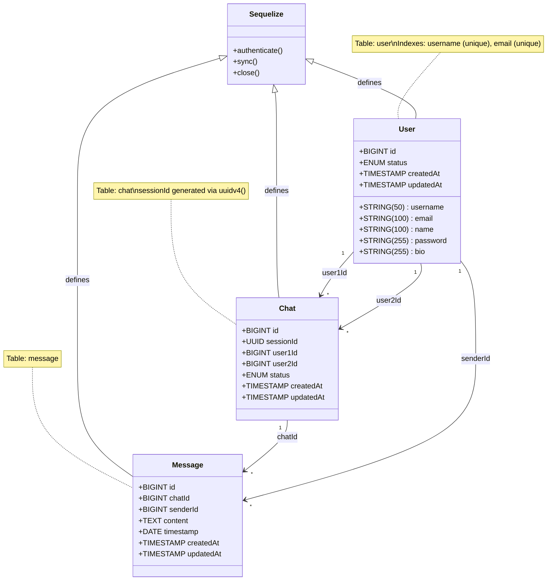

# Models - Class Diagram

```mermaid
classDiagram
    class User {
        +BIGINT id
        +STRING(50) username
        +STRING(100) email
        +STRING(100) name
        +STRING(255) password
        +STRING(255) bio
        +ENUM status
        +TIMESTAMP createdAt
        +TIMESTAMP updatedAt
    }

    class Chat {
        +BIGINT id
        +UUID sessionId
        +BIGINT user1Id
        +BIGINT user2Id
        +ENUM status
        +TIMESTAMP createdAt
        +TIMESTAMP updatedAt
    }

    class Message {
        +BIGINT id
        +BIGINT chatId
        +BIGINT senderId
        +TEXT content
        +DATE timestamp
        +TIMESTAMP createdAt
        +TIMESTAMP updatedAt
    }

    class Sequelize {
        +authenticate()
        +sync()
        +close()
    }

    Sequelize <|-- User : defines
    Sequelize <|-- Chat : defines
    Sequelize <|-- Message : defines

    User "1" --> "*" Chat : user1Id
    User "1" --> "*" Chat : user2Id
    Chat "1" --> "*" Message : chatId
    User "1" --> "*" Message : senderId

    note for User "Table: user\nIndexes: username (unique), email (unique)"
    note for Chat "Table: chat\nsessionId generated via uuidv4()"
    note for Message "Table: message"
```
