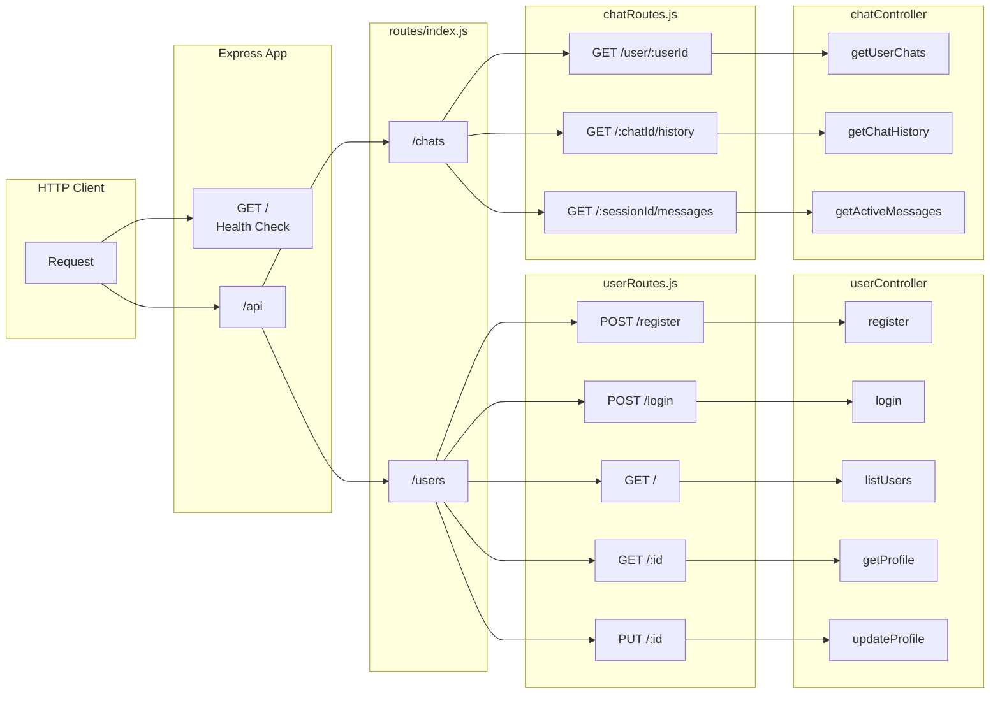
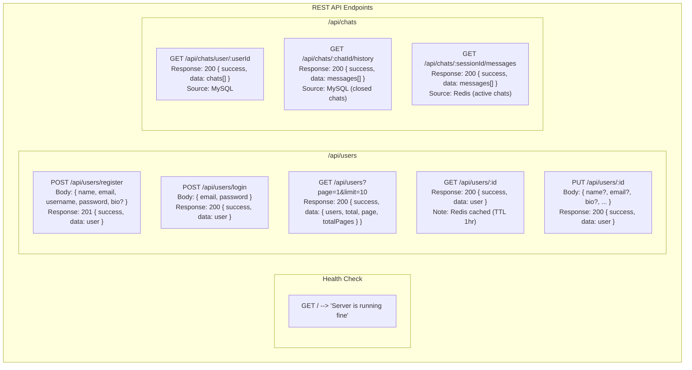

# Routes - API Endpoint Mapping

## Route Tree

```mermaid
flowchart LR
    subgraph Client["HTTP Client"]
        REQ["Request"]
    end

    subgraph Express["Express App"]
        ROOT["GET /\nHealth Check"]
        API["/api"]
    end

    subgraph RouteIndex["routes/index.js"]
        UR["/users"]
        CR["/chats"]
    end

    subgraph UserRoutes["userRoutes.js"]
        UR1["POST /register"]
        UR2["POST /login"]
        UR3["GET /"]
        UR4["GET /:id"]
        UR5["PUT /:id"]
    end

    subgraph ChatRoutes["chatRoutes.js"]
        CR1["GET /user/:userId"]
        CR2["GET /:chatId/history"]
        CR3["GET /:sessionId/messages"]
    end

    subgraph UserCtrl["userController"]
        UC1["register"]
        UC2["login"]
        UC3["listUsers"]
        UC4["getProfile"]
        UC5["updateProfile"]
    end

    subgraph ChatCtrl["chatController"]
        CC1["getUserChats"]
        CC2["getChatHistory"]
        CC3["getActiveMessages"]
    end

    REQ --> ROOT
    REQ --> API
    API --> UR
    API --> CR

    UR --> UR1 --> UC1
    UR --> UR2 --> UC2
    UR --> UR3 --> UC3
    UR --> UR4 --> UC4
    UR --> UR5 --> UC5

    CR --> CR1 --> CC1
    CR --> CR2 --> CC2
    CR --> CR3 --> CC3
```

## Full API Endpoint Reference

```mermaid
graph TD
    subgraph Endpoints["REST API Endpoints"]

        subgraph Health["Health Check"]
            H1["GET / --> 'Server is running fine'"]
        end

        subgraph Users["/api/users"]
            U1["POST /api/users/register\nBody: { name, email, username, password, bio? }\nResponse: 201 { success, data: user }"]
            U2["POST /api/users/login\nBody: { email, password }\nResponse: 200 { success, data: user }"]
            U3["GET /api/users?page=1&limit=10\nResponse: 200 { success, data: { users, total, page, totalPages } }"]
            U4["GET /api/users/:id\nResponse: 200 { success, data: user }\nNote: Redis cached (TTL 1hr)"]
            U5["PUT /api/users/:id\nBody: { name?, email?, bio?, ... }\nResponse: 200 { success, data: user }"]
        end

        subgraph Chats["/api/chats"]
            C1["GET /api/chats/user/:userId\nResponse: 200 { success, data: chats[] }\nSource: MySQL"]
            C2["GET /api/chats/:chatId/history\nResponse: 200 { success, data: messages[] }\nSource: MySQL (closed chats)"]
            C3["GET /api/chats/:sessionId/messages\nResponse: 200 { success, data: messages[] }\nSource: Redis (active chats)"]
        end
    end
```
