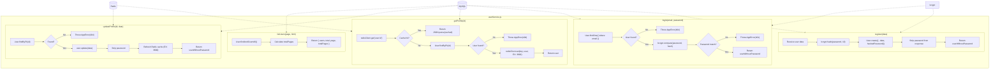
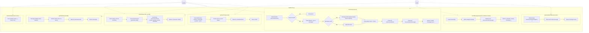

# Services - Business Logic Layer

## User Service

```mermaid
flowchart TD
    subgraph userService["userService.js"]
        direction TB

        subgraph register["register(data)"]
            R1["Receive user data"] --> R2["bcrypt.hash(password, 10)"]
            R2 --> R3["User.create({...data, hashedPassword})"]
            R3 --> R4["Strip password from response"]
            R4 --> R5["Return userWithoutPassword"]
        end

        subgraph login["login(email, password)"]
            L1["User.findOne({ where: email })"] --> L2{"User found?"}
            L2 -- No --> L3["Throw AppError(404)"]
            L2 -- Yes --> L4["bcrypt.compare(password, hash)"]
            L4 --> L5{"Password match?"}
            L5 -- No --> L6["Throw AppError(401)"]
            L5 -- Yes --> L7["Return userWithoutPassword"]
        end

        subgraph getProfile["getProfile(id)"]
            G1["redisClient.get('user:id')"] --> G2{"Cache hit?"}
            G2 -- Yes --> G3["Return JSON.parse(cached)"]
            G2 -- No --> G4["User.findByPk(id)"]
            G4 --> G5{"User found?"}
            G5 -- No --> G6["Throw AppError(404)"]
            G5 -- Yes --> G7["redisClient.set(key, user, EX: 3600)"]
            G7 --> G8["Return user"]
        end

        subgraph updateProfile["updateProfile(id, data)"]
            U1["User.findByPk(id)"] --> U2{"Found?"}
            U2 -- No --> U3["Throw AppError(404)"]
            U2 -- Yes --> U4["user.update(data)"]
            U4 --> U5["Strip password"]
            U5 --> U6["Refresh Redis cache (EX: 3600)"]
            U6 --> U7["Return userWithoutPassword"]
        end

        subgraph listUsers["listUsers(page, limit)"]
            LU1["User.findAndCountAll()"] --> LU2["Calculate totalPages"]
            LU2 --> LU3["Return { users, total, page, totalPages }"]
        end
    end

    MySQL[(MySQL)] -.-> register
    MySQL -.-> login
    MySQL -.-> getProfile
    MySQL -.-> updateProfile
    MySQL -.-> listUsers
    Redis[(Redis)] -.-> getProfile
    Redis -.-> updateProfile
    BCrypt[bcrypt] -.-> register
    BCrypt -.-> login
```

## Chat Service

```mermaid
flowchart TD
    subgraph chatService["chatService.js"]
        direction TB

        subgraph setUserStatus["setUserStatus(userId, status)"]
            SU1["User.update({ status }, { where: id })"]
        end

        subgraph startChat["startChat(user1Id, user2Id)"]
            SC1["Chat.create({ user1Id, user2Id })"]
            SC1 --> SC2["Get sessionId (auto-generated UUID)"]
            SC2 --> SC3["Redis hSet chat:sessionId:info\n{chatId, user1Id, user2Id, startedAt}"]
            SC3 --> SC4["Return { sessionId, chatId }"]
        end

        subgraph sendMessage["sendMessage(sessionId, senderId, content)"]
            SM1["Create timestamp"] --> SM2["JSON.stringify message"]
            SM2 --> SM3["Redis rPush chat:sessionId:messages"]
            SM3 --> SM4["Return { senderId, content, timestamp }"]
        end

        subgraph endChat["endChat(sessionId)"]
            EC1["Redis hGetAll chat:sessionId:info"]
            EC1 --> EC2{"Session found?"}
            EC2 -- No --> EC3["Throw Error"]
            EC2 -- Yes --> EC4["Redis lRange - get all messages"]
            EC4 --> EC5{"Messages exist?"}
            EC5 -- Yes --> EC6["Message.bulkCreate(messages)\nFlush to MySQL"]
            EC5 -- No --> EC7["Skip bulk insert"]
            EC6 --> EC8["Chat.update status = closed"]
            EC7 --> EC8
            EC8 --> EC9["Redis del chat:sessionId:info"]
            EC9 --> EC10["Redis del chat:sessionId:messages"]
            EC10 --> EC11["Return { chatId, messageCount }"]
        end

        subgraph getActiveMessages["getActiveMessages(sessionId)"]
            GA1["Redis lRange chat:sessionId:messages 0 -1"]
            GA1 --> GA2["Parse each JSON message"]
            GA2 --> GA3["Return messages array"]
        end

        subgraph getChatHistory["getChatHistory(chatId)"]
            GH1["Message.findAll({ where: chatId })"]
            GH1 --> GH2["Include sender (User: id, name)"]
            GH2 --> GH3["Order by timestamp ASC"]
            GH3 --> GH4["Return messages"]
        end

        subgraph getUserChats["getUserChats(userId)"]
            GC1["Chat.findAll where\nuser1Id = userId OR user2Id = userId"]
            GC1 --> GC2["Include user1 & user2 details"]
            GC2 --> GC3["Order by createdAt DESC"]
            GC3 --> GC4["Return chats"]
        end
    end

    MySQL[(MySQL)] -.-> setUserStatus
    MySQL -.-> startChat
    MySQL -.-> endChat
    MySQL -.-> getChatHistory
    MySQL -.-> getUserChats
    Redis[(Redis)] -.-> startChat
    Redis -.-> sendMessage
    Redis -.-> endChat
    Redis -.-> getActiveMessages
```
