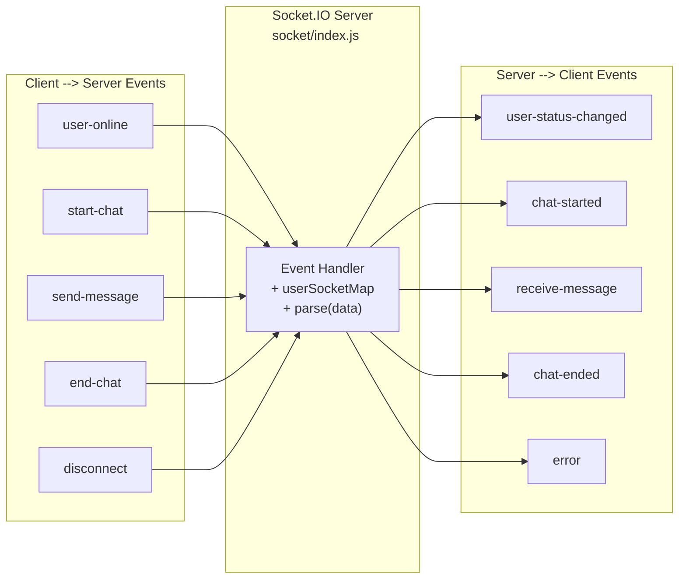
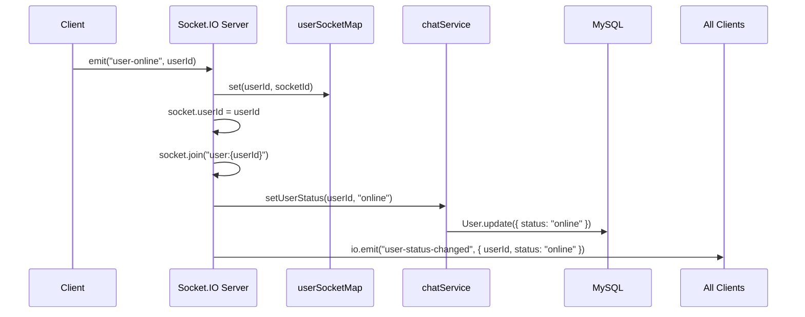
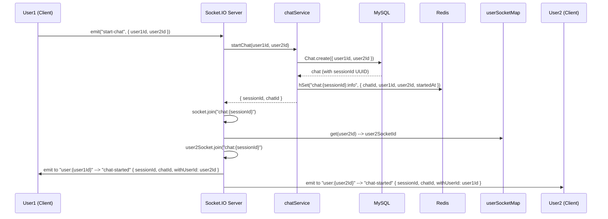
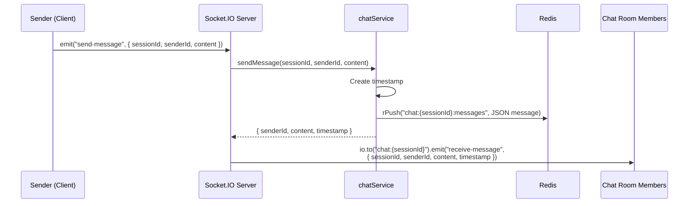
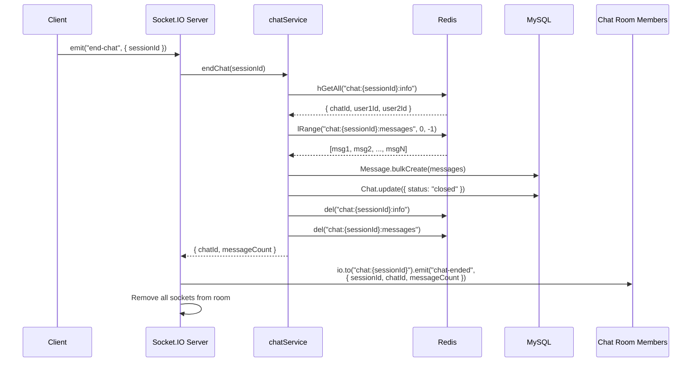
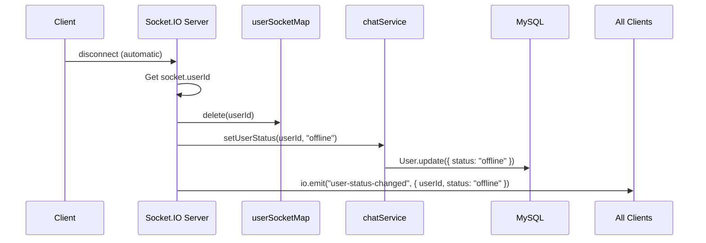
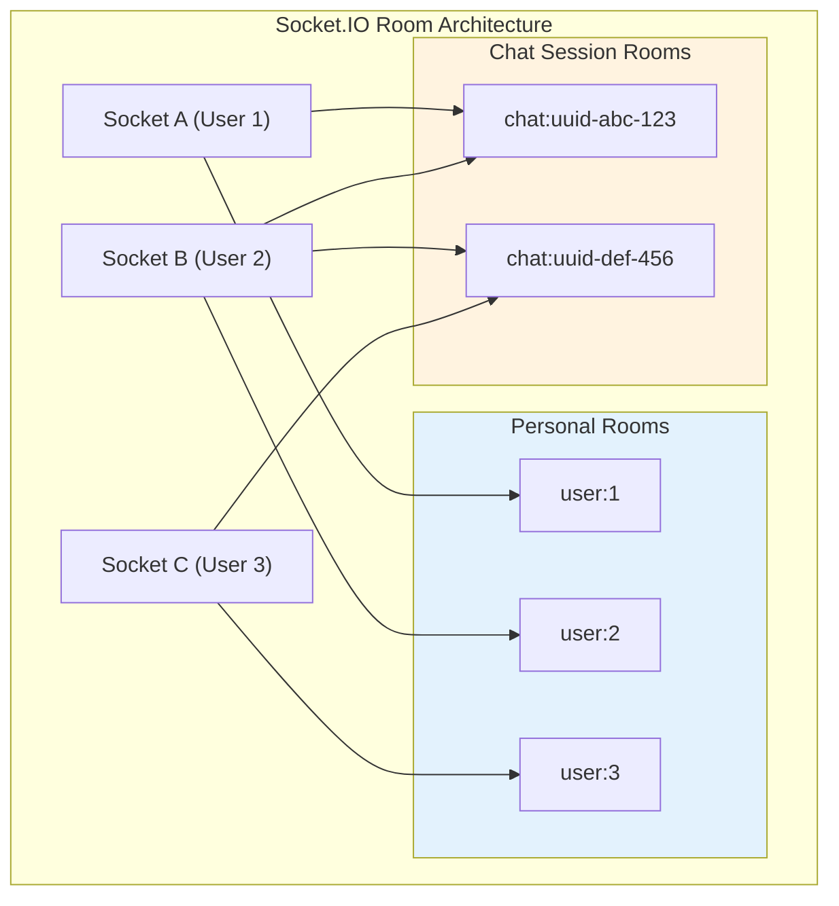

# Socket.IO - Real-Time Event Flows

## Event Overview

```mermaid
flowchart LR
    subgraph ClientEvents["Client --> Server Events"]
        E1["user-online"]
        E2["start-chat"]
        E3["send-message"]
        E4["end-chat"]
        E5["disconnect"]
    end

    subgraph SocketServer["Socket.IO Server\nsocket/index.js"]
        Handler["Event Handler\n+ userSocketMap\n+ parse(data)"]
    end

    subgraph ServerEvents["Server --> Client Events"]
        S1["user-status-changed"]
        S2["chat-started"]
        S3["receive-message"]
        S4["chat-ended"]
        S5["error"]
    end

    E1 --> Handler
    E2 --> Handler
    E3 --> Handler
    E4 --> Handler
    E5 --> Handler

    Handler --> S1
    Handler --> S2
    Handler --> S3
    Handler --> S4
    Handler --> S5
```

## User Online Flow

```mermaid
sequenceDiagram
    participant C as Client
    participant S as Socket.IO Server
    participant Map as userSocketMap
    participant CS as chatService
    participant DB as MySQL
    participant All as All Clients

    C->>S: emit("user-online", userId)
    S->>Map: set(userId, socketId)
    S->>S: socket.userId = userId
    S->>S: socket.join("user:{userId}")
    S->>CS: setUserStatus(userId, "online")
    CS->>DB: User.update({ status: "online" })
    S->>All: io.emit("user-status-changed", { userId, status: "online" })
```

## Start Chat Flow

```mermaid
sequenceDiagram
    participant U1 as User1 (Client)
    participant S as Socket.IO Server
    participant CS as chatService
    participant DB as MySQL
    participant R as Redis
    participant Map as userSocketMap
    participant U2 as User2 (Client)

    U1->>S: emit("start-chat", { user1Id, user2Id })
    S->>CS: startChat(user1Id, user2Id)
    CS->>DB: Chat.create({ user1Id, user2Id })
    DB-->>CS: chat (with sessionId UUID)
    CS->>R: hSet("chat:{sessionId}:info", { chatId, user1Id, user2Id, startedAt })
    CS-->>S: { sessionId, chatId }

    S->>S: socket.join("chat:{sessionId}")
    S->>Map: get(user2Id) --> user2SocketId
    S->>S: user2Socket.join("chat:{sessionId}")

    S->>U1: emit to "user:{user1Id}" --> "chat-started" { sessionId, chatId, withUserId: user2Id }
    S->>U2: emit to "user:{user2Id}" --> "chat-started" { sessionId, chatId, withUserId: user1Id }
```

## Send Message Flow

```mermaid
sequenceDiagram
    participant Sender as Sender (Client)
    participant S as Socket.IO Server
    participant CS as chatService
    participant R as Redis
    participant Room as Chat Room Members

    Sender->>S: emit("send-message", { sessionId, senderId, content })
    S->>CS: sendMessage(sessionId, senderId, content)
    CS->>CS: Create timestamp
    CS->>R: rPush("chat:{sessionId}:messages", JSON message)
    CS-->>S: { senderId, content, timestamp }
    S->>Room: io.to("chat:{sessionId}").emit("receive-message",<br/>{ sessionId, senderId, content, timestamp })
```

## End Chat Flow

```mermaid
sequenceDiagram
    participant C as Client
    participant S as Socket.IO Server
    participant CS as chatService
    participant R as Redis
    participant DB as MySQL
    participant Room as Chat Room Members

    C->>S: emit("end-chat", { sessionId })
    S->>CS: endChat(sessionId)
    CS->>R: hGetAll("chat:{sessionId}:info")
    R-->>CS: { chatId, user1Id, user2Id }
    CS->>R: lRange("chat:{sessionId}:messages", 0, -1)
    R-->>CS: [msg1, msg2, ..., msgN]
    CS->>DB: Message.bulkCreate(messages)
    CS->>DB: Chat.update({ status: "closed" })
    CS->>R: del("chat:{sessionId}:info")
    CS->>R: del("chat:{sessionId}:messages")
    CS-->>S: { chatId, messageCount }

    S->>Room: io.to("chat:{sessionId}").emit("chat-ended",<br/>{ sessionId, chatId, messageCount })
    S->>S: Remove all sockets from room
```

## Disconnect Flow

```mermaid
sequenceDiagram
    participant C as Client
    participant S as Socket.IO Server
    participant Map as userSocketMap
    participant CS as chatService
    participant DB as MySQL
    participant All as All Clients

    C->>S: disconnect (automatic)
    S->>S: Get socket.userId
    S->>Map: delete(userId)
    S->>CS: setUserStatus(userId, "offline")
    CS->>DB: User.update({ status: "offline" })
    S->>All: io.emit("user-status-changed", { userId, status: "offline" })
```

## Room Structure

```mermaid
graph TD
    subgraph SocketRooms["Socket.IO Room Architecture"]
        subgraph PersonalRooms["Personal Rooms"]
            PR1["user:1"]
            PR2["user:2"]
            PR3["user:3"]
        end

        subgraph ChatRooms["Chat Session Rooms"]
            CR1["chat:uuid-abc-123"]
            CR2["chat:uuid-def-456"]
        end

        S1["Socket A (User 1)"] --> PR1
        S1 --> CR1

        S2["Socket B (User 2)"] --> PR2
        S2 --> CR1
        S2 --> CR2

        S3["Socket C (User 3)"] --> PR3
        S3 --> CR2
    end

    style PersonalRooms fill:#e3f2fd
    style ChatRooms fill:#fff3e0
```
